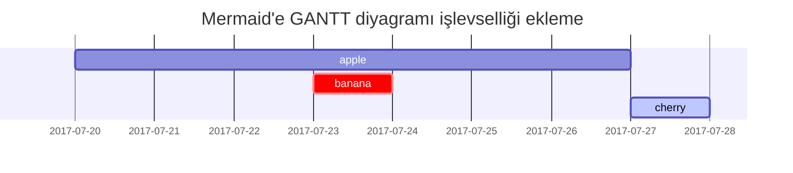

## Başlıklar

<!-- markdownlint-capture -->
<!-- markdownlint-disable -->
# H1 - başlık
{: .mt-4 .mb-0 }

## H2 - başlık
{: data-toc-skip='' .mt-4 .mb-0 }

### H3 - başlık
{: data-toc-skip='' .mt-4 .mb-0 }

#### H4 - başlık
{: data-toc-skip='' .mt-4 }
<!-- markdownlint-restore -->

## Paragraf

Quisque egestas convallis ipsum, ut sollicitudin risus tincidunt a. Maecenas interdum malesuada egestas. Duis consectetur porta risus, sit amet vulputate urna facilisis ac. Phasellus semper dui non purus ultrices sodales. Aliquam ante lorem, ornare a feugiat ac, finibus nec mauris. Vivamus ut tristique nisi. Sed vel leo vulputate, efficitur risus non, posuere mi. Nullam tincidunt bibendum rutrum. Proin commodo ornare sapien. Vivamus interdum diam sed sapien blandit, sit amet aliquam risus mattis. Nullam arcu turpis, mollis quis laoreet at, placerat id nibh. Suspendisse venenatis eros eros.

## Listeler

### Sıralı Liste

1. İlk olarak
2. İkinci olarak
3. Üçüncü olarak

### Sırasız Liste

- Bölüm
  - Alt Bölüm
    - Paragraf

### Yapılacaklar Listesi

- [ ] İş
  - [x] Adım 1
  - [x] Adım 2
  - [ ] Adım 3

### Tanım Listesi

Güneş
: Dünya'nın etrafında döndüğü yıldız

Ay
: Dünya'nın doğal uydusu, güneşten yansıyan ışıkla görünür

## Blok Alıntı

> Bu satır _blok alıntıyı_ gösterir.

## İpuçları

<!-- markdownlint-capture -->
<!-- markdownlint-disable -->
> `tip` türünü gösteren bir örnek.
{: .prompt-tip }

> `info` türünü gösteren bir örnek.
{: .prompt-info }

> `warning` türünü gösteren bir örnek.
{: .prompt-warning }

> `danger` türünü gösteren bir örnek.
{: .prompt-danger }
<!-- markdownlint-restore -->

## Tablolar

| Şirket                       | İletişim         | Ülke      |
| :--------------------------- | :--------------  | ---------:|
| Alfreds Futterkiste          | Maria Anders     | Almanya   |
| Island Trading               | Helen Bennett    |      UK   |
| Magazzini Alimentari Riuniti | Giovanni Rovelli |   İtalya  |
| Onu Söyleyemiyoruz Maalesef   | Adem Avşar       |   Türkiye |


## Bağlantılar

<http://127.0.0.1:4000>

## Dipnot

Tıkla, bağlantı seni dipnota[^footnote] götürecek, ve işte bir başka dipnot[^fn-nth-2].

## Satır İçi Kod

Bu, `Satır İçi Kod` örneğidir.

## Dosya Yolu

İşte `/path/to/the/file.extend`{: .filepath} dosya yolu.

## Buton

<kbd>OK</kbd> <kbd>Cancel</kbd>

## Vurgu

Sizler, yani yeni Türkiye´nin genç evlatları, yorulsanız dahi beni takip edeceksiniz. Dinlenmemek üzere yürümeye karar verenler <mark>asla ve asla yorulmazlar;</mark> Türk gençliği, gayeye, bizim yüksek idealimize durmadan, yorulmadan yürüyecektir.

## Kod Blokları

### Genel

```text
Bu, sözdizimi vurgusu ve satır numarası olmayan genel bir kod parçacığıdır.
```

### Belirli Dil

```bash
if [ $? -ne 0 ]; then
  echo "Komut başarılı değildi.";
  #gerekli işlemleri yap / çık
fi;
```

### Belirli dosya adı

```sass
@import
  "colors/light-typography",
  "colors/dark-typography";
```
{: file='_sass/jekyll-theme-chirpy.scss'}

## Matematik

[MathJax](https://www.mathjax.org/) tarafından desteklenen matematik:

$$
\begin{equation}
  \sum_{n=1}^\infty 1/n^2 = \frac{\pi^2}{6}
  \label{eq:series}
\end{equation}
$$

Denklemi \eqref{eq:series} olarak referans alabiliriz.

$a \ne 0$ iken,

 $ax^2 + bx + c = 0$ denkleminin çözümleri şunlardır

$$ x = {-b \pm \sqrt{b^2-4ac} \over 2a} $$

## Mermaid SVG




Mermaid, özellikle yazılım geliştirme ve teknik dokümantasyon süreçlerinde oldukça kullanışlı bir araçtır. Markdown dosyaları içinde yer alan basit kod bloklarıyla çeşitli görsel diyagramlar üretebilir. Bu diyagramlar arasında akış şemaları, sınıf diyagramları, dizi diyagramları ve Gantt çizelgeleri gibi farklı türler bulunur.

Mermaid kullanıcıların karmaşık görsel tasarımları hızlıca oluşturmasını sağlar. Örneğin, bir projenin zaman çizelgesini veya yazılım bileşenlerinin etkileşimini gösteren diyagramlar yapabilirsiniz. Kod tabanlı olduğu için, diyagramlar versiyon kontrol sistemleriyle kolayca yönetilebilir ve değişiklikler takip edilebilir. Bu, özellikle ekip çalışmalarında ve sürekli güncellenen projelerde büyük avantaj sağlar.

Mermaid’in en büyük avantajlarından biri, görsel içeriği doğrudan kod içerisinden yönetebilme yeteneğidir. Böylece, dışarıdan bir grafik tasarım aracına ihtiyaç duymadan doğrudan teknik dokümanlarınızda veya GitHub gibi platformlarda dokümantasyonunuzu zenginleştirebilirsiniz.



## Görüntüler

### Varsayılan (altyazı ile)

{: width="972" height="589" }
_Tam ekran genişliği ve orta hizalama_

### Sol hizalı

{: width="972" height="589" .w-75 .normal}

### Sola yatık

{: width="972" height="589" .w-50 .left}
Praesent maximus aliquam sapien. Sed vel neque in dolor pulvinar auctor. Maecenas pharetra, sem sit amet interdum posuere, tellus lacus eleifend magna, ac lobortis felis ipsum id sapien. Proin ornare rutrum metus, ac convallis diam volutpat sit amet. Phasellus volutpat, elit sit amet tincidunt mollis, felis mi scelerisque mauris, ut facilisis leo magna accumsan sapien. In rutrum vehicula nisl eget tempor. Nullam maximus ullamcorper libero non maximus. Integer ultricies velit id convallis varius. Praesent eu nisl eu urna finibus ultrices id nec ex. Mauris ac mattis quam. Fusce aliquam est nec sapien bibendum, vitae malesuada ligula condimentum.

### Sağa yatık

{: width="972" height="589" .w-50 .right}
Praesent maximus aliquam sapien. Sed vel neque in dolor pulvinar auctor. Maecenas pharetra, sem sit amet interdum posuere, tellus lacus eleifend magna, ac lobortis felis ipsum id sapien. Proin ornare rutrum metus, ac convallis diam volutpat sit amet. Phasellus volutpat, elit sit amet tincidunt mollis, felis mi scelerisque mauris, ut facilisis leo magna accumsan sapien. In rutrum vehicula nisl eget tempor. Nullam maximus ullamcorper libero non maximus. Integer ultricies velit id convallis varius. Praesent eu nisl eu urna finibus ultrices id nec ex. Mauris ac mattis quam. Fusce aliquam est nec sapien bibendum, vitae malesuada ligula condimentum.

### Karanlık/Aydınlık mod & Gölge

Aşağıdaki resim, tema tercihine bağlı olarak karanlık/aydınlık modda değişir, gölgeleri fark edin.

{: .light .w-75 .shadow .rounded-10 w='1212' h='668' }
{: .dark .w-75 .shadow .rounded-10 w='1212' h='668' }

## Video



## Ters Dipnot

[^footnote]: Dipnot kaynağı
[^fn-nth-2]: İkinci dipnot kaynağı